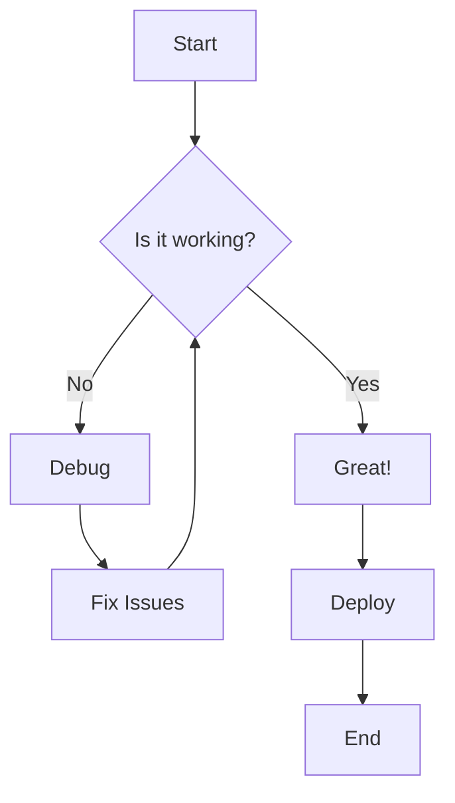
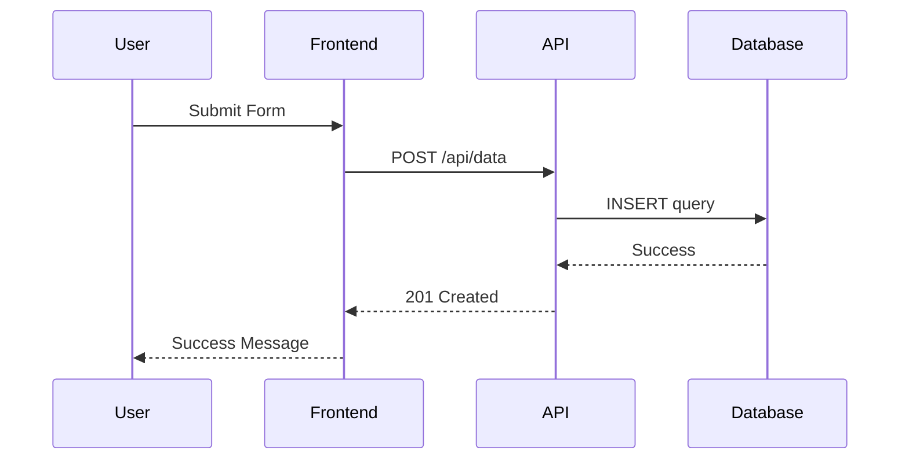
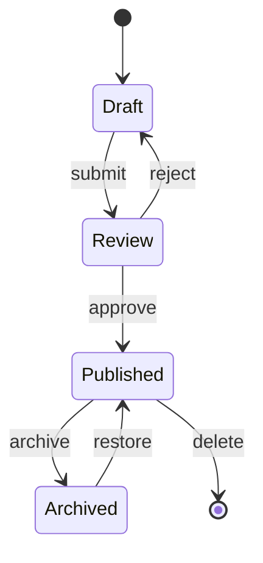
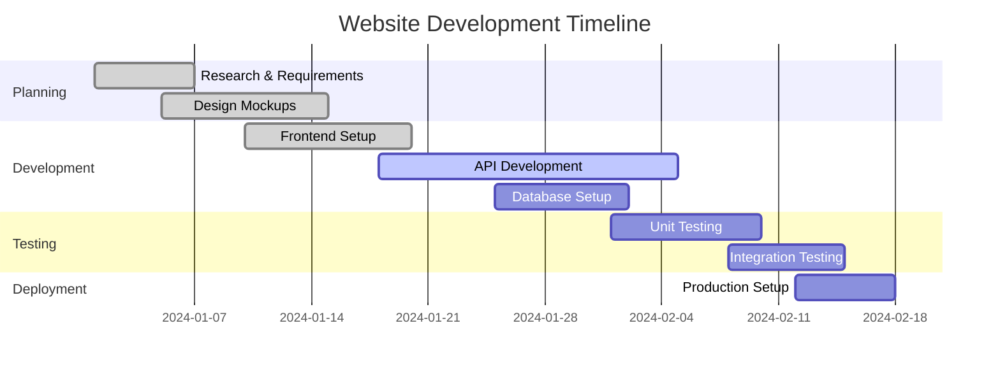
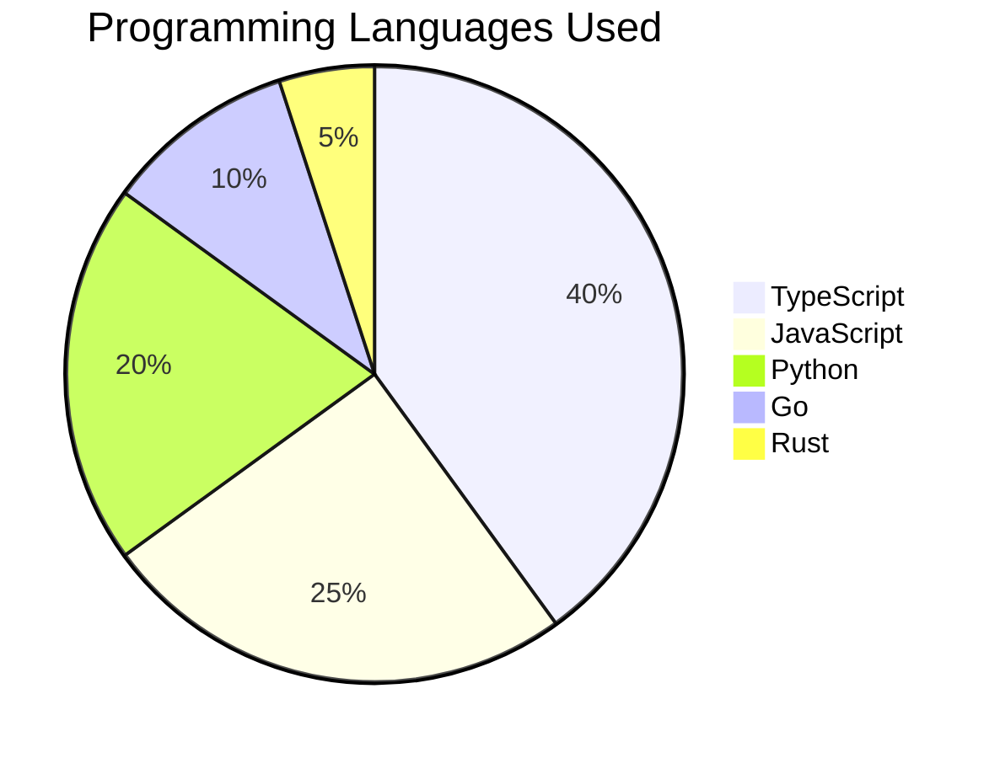
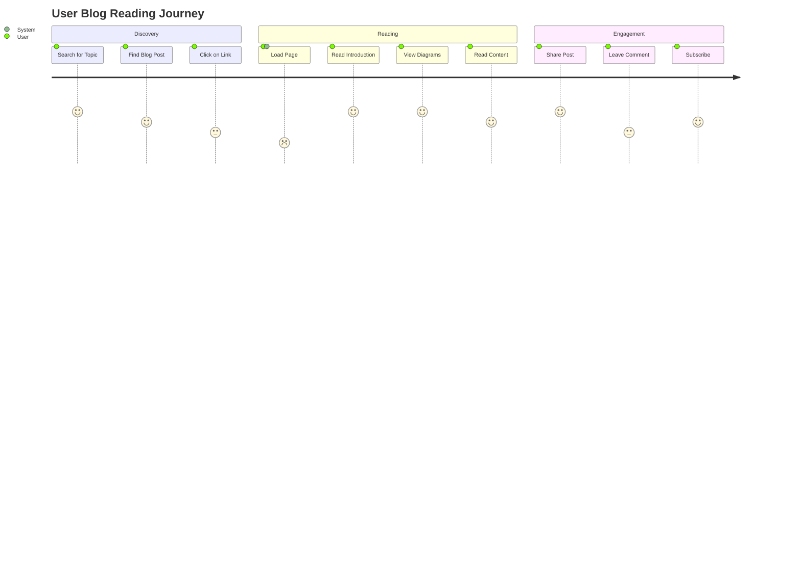
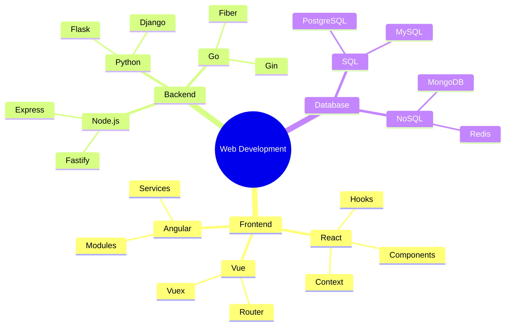
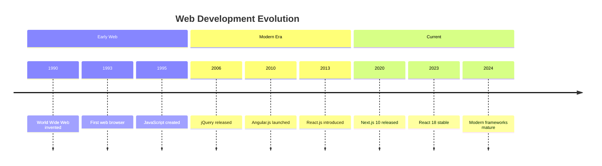

# Complete Guide to Mermaid Diagrams

Mermaid is a powerful diagramming and charting tool that uses simple text syntax to create complex visualizations. This guide demonstrates various types of diagrams you can create in your blog posts.

## Flowcharts

Flowcharts are perfect for showing processes, decision trees, and workflows:



## Sequence Diagrams

Sequence diagrams are excellent for showing interactions between different actors or systems:



## Class Diagrams

Visualize object-oriented design with class diagrams:

```mermaid
classDiagram
    class BlogPost {
        +String title
        +String content
        +Date publishedAt
        +Boolean featured
        +publish()
        +unpublish()
    }
    
    class Author {
        +String name
        +String email
        +Array~BlogPost~ posts
        +createPost()
        +deletePost()
    }
    
    class Tag {
        +String name
        +String slug
        +String color
    }
    
    Author ||--o{ BlogPost : writes
    BlogPost }|--|| Tag : has
```

## State Diagrams

Show state transitions and system behavior:



## Gantt Charts

Perfect for project planning and timeline visualization:



## Pie Charts

Simple and effective for showing data distribution:



## Git Graphs

Visualize Git branching and merging strategies:

```mermaid
gitgraph
    commit id: "Initial"
    branch develop
    checkout develop
    commit id: "Feature A"
    commit id: "Feature B"
    checkout main
    merge develop
    commit id: "Release v1.0"
    branch hotfix
    checkout hotfix
    commit id: "Bug Fix"
    checkout main
    merge hotfix
    commit id: "v1.0.1"
```

## User Journey Maps

Map out user experiences and touchpoints:



## Mind Maps

Organize ideas and concepts visually:



## Timeline Diagrams

Show events in chronological order:



## Advanced Features

### Custom Styling

Mermaid diagrams automatically inherit your site's dark theme with custom colors:

- **Primary Color**: Cyan (#06b6d4)
- **Background**: True black (#000000)
- **Text**: White (#ffffff)
- **Borders**: Dark gray (#27272a)

### Interactive Features

Each diagram comes with built-in features:

1. **Copy Source**: Hover over a diagram to copy the Mermaid source code
2. **Download SVG**: Export diagrams as scalable vector graphics
3. **Fullscreen View**: Click to view diagrams in fullscreen mode
4. **Error Handling**: Clear error messages for syntax issues

### Best Practices

1. **Keep it Simple**: Start with basic diagrams and add complexity gradually
2. **Use Meaningful Labels**: Make node and edge labels descriptive
3. **Consistent Styling**: Stick to a consistent naming convention
4. **Test Syntax**: Verify your diagrams render correctly before publishing

## Conclusion

Mermaid diagrams are a powerful way to enhance your technical blog posts. They provide visual clarity to complex concepts and make your content more engaging. Experiment with different diagram types to find what works best for your content!

For more advanced features and syntax options, check out the [official Mermaid documentation](https://mermaid.js.org/).